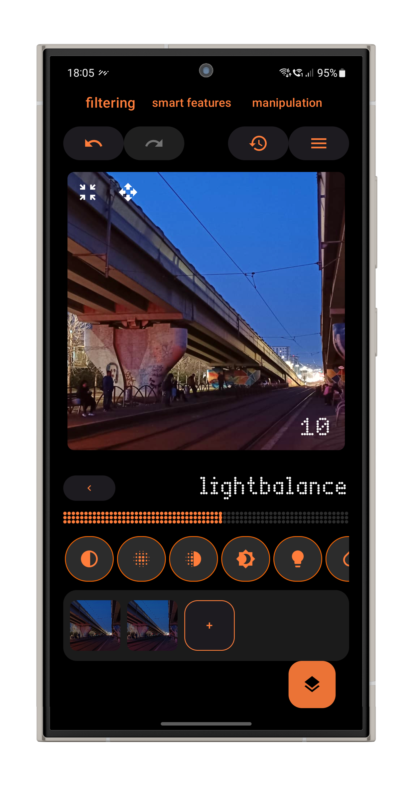
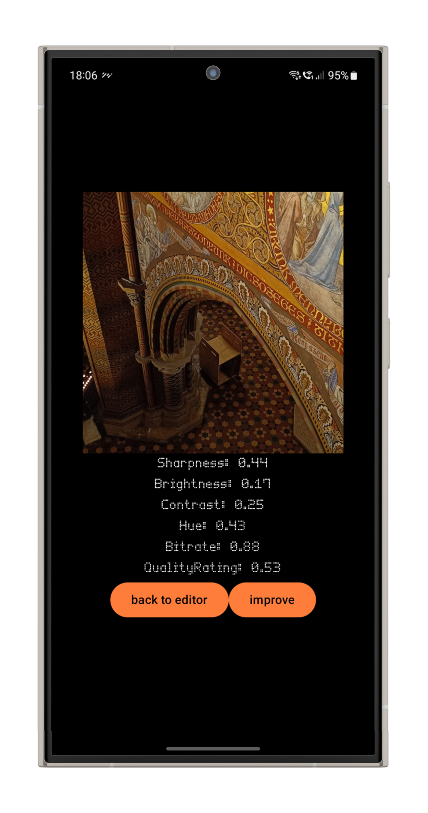
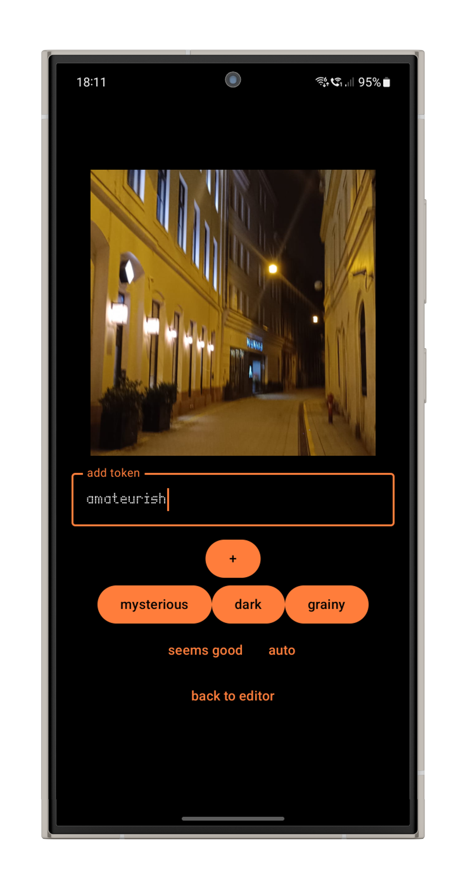
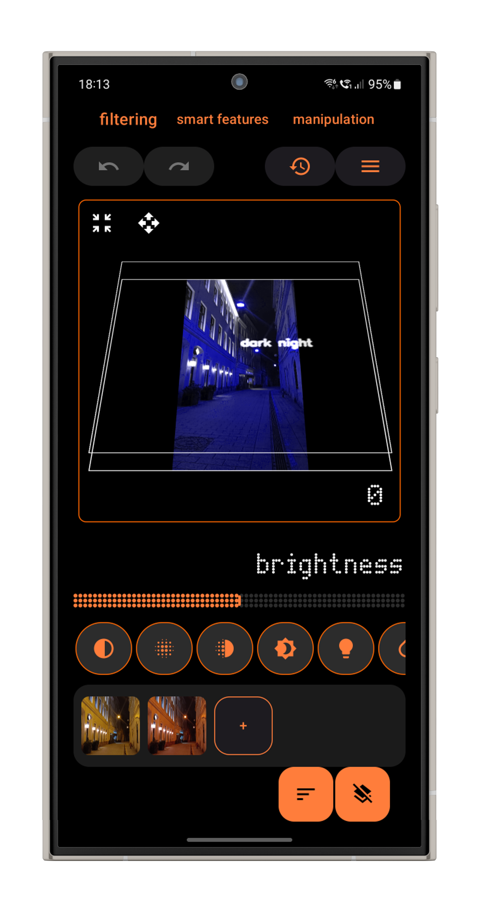
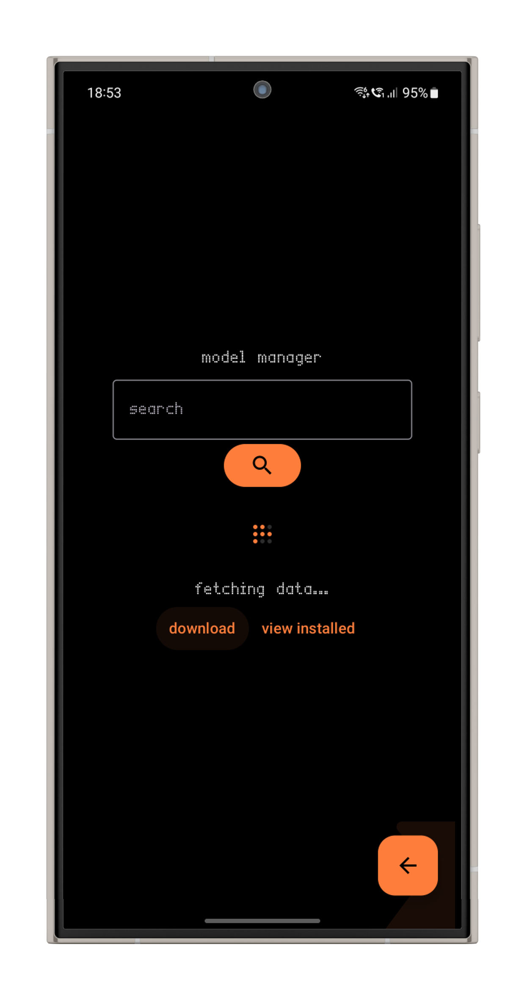

<div align="center">
  
  <h1>morphlect</h1>
  <p><strong>Native Android image processing app using on-device inference</strong></p>

  <!-- Badges -->
  <a href="https://github.com/silviu28/morphlect-android/actions">
    
  </a>
  <a href="https://github.com/silviu28/morphlect-android/issues">
    
  </a>
  <a href="https://github.com/yourusername/your-repo/blob/main/LICENSE">
    
  </a>
  <br>
  <a href="https://play.google.com/store/apps/details?id=com.yourpackage">
    
  </a>
</div>

---

**Morphlect** (stylized as **morphlect**) is a photo editing app. It uses high-performance image processing and machine-learning to both offer advanced tools for personal tweaks while also using algorithms to automatically enhance images and giving you different perspectives. The app focuses on augmenting the user's creativity rather than replace them in the creative process.

### Key Features

- **Easy and quick filter adjustment** - Use familiar controls to manually adjust images however you like
- **Image quality assessment and enhancement** - Let the app find what's best for your image
- **Creative tooling** - Switch up the way you're looking at image processing by either describing the final result or adding another reference image
- **Extensible** - Download and manage MXT (Morphlect eXTension) extensions that further add to your creative process
- **Advanced tools** - Use professional tools (like undo stack and layers) from your device with reduced friction
- **Offline support** - Everything works perfectly fine even without a persistent Internet connection. Only required for online features, like extension download
- **Camera mode** - Use artificial-intelligence tooling before and after taking your picture

---

### Technologies

> The app is written in Kotlin, using Jetpack Compose for state management and user interface.
> 
> For hardware-accelerated image processing it uses the <a href="https://mvnrepository.com/artifact/org.opencv/opencv">OpenCV Android port</a>.
>
> AI inference is done through TFLite/LiteRT model bundling and processing.
>
> Camera, preferences storage and other native functionalities are implemented through first-party Android packages.

Check out the <a href="https://github.com/silviu28/morphlect-server">server template</a> repository for more information on the extension server backend.

---

## Screenshots

<div align="center">
  
  
  
  
  
</div>

---
## Development and Build

### Prerequisites

- [JDK](https://www.oracle.com/java/technologies/javase/jdk17-archive-downloads.html) (17 or higher)
- [Git](https://git-scm.com/)
- An IDE (Android Studio / IntelliJ) or text editor (VS Code, Sublime Text)
- A mobile device or emulator running Android 10 or higher

### Installation

1. **Clone the repository**

```
git clone https://github.com/silviu28/morphlect-android.git
cd morphlect-android
```

2a. **Create a fast build (no test run)**

```
./gradlew build -x test
```

2b. **Create a build (runs unit tests)**

```
./gradlew build
```

3. **Run local tests**

```
./gradlew test
```
These run on the host, thus not requiring a connection to mobile device/emulator.

4. **Run instrumented tests**

```
./gradlew connectedAndroidTest
```
These only run on the device. Beware if you have an existing build as the test execution might remove the app.

5. **Install on device**

```
./gradlew :app:installDebug
```

## Contributing

While the project isn't actively maintained, contributions are welcome. Do not push directly on the `master` branch and create a PR. Even if the workflow fails your contribution may still pass after approval. Purely AI-generated contributions are prohibited.

## Additional Credits
- Android Semantic Search repository for helpful transformer loading and wiring logic https://github.com/hissain/AndroidSemanticSearch
- CameraX OpenCV repository for helpful CameraX and OpenCV linking logic https://github.com/mcanyucel/camerax-opencv
  
<sub>silviu28 | 2026</sub>
